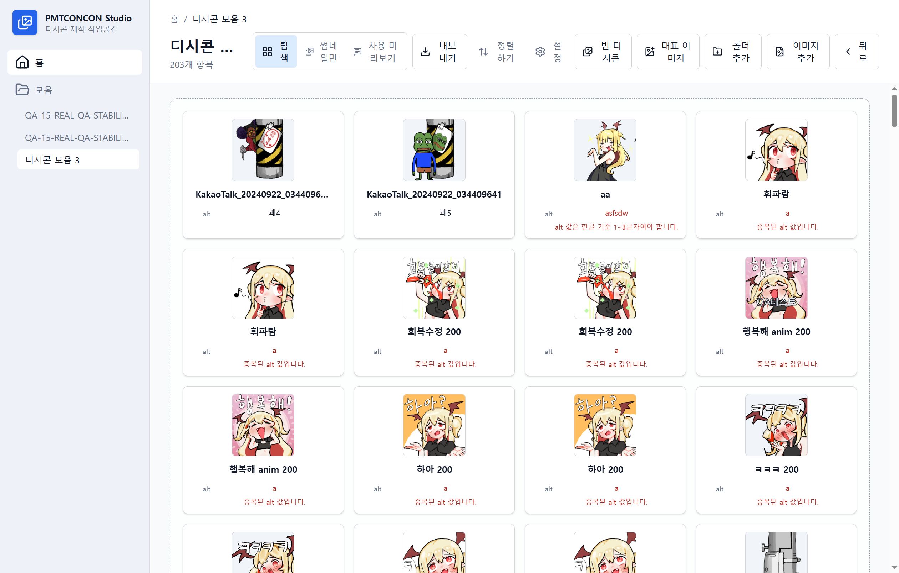

# PMTCONCON Studio

PMTCONCON Studio는 DCInside 스타일 디시콘과 커스텀 이모티콘 모음을 제작하기 위한 Windows 데스크톱 앱입니다. 이미지와 GIF를 가져오고, 모음 단위로 정리하고, 아이콘을 편집한 뒤, 업로드 가능한 파일과 `alts.txt`를 내보내는 작업 흐름을 제공합니다.



## 주요 기능

- Windows 파일 탐색기와 비슷한 모음/아이콘 관리 화면
- JPG, PNG, 애니메이션 GIF 파일 및 폴더 가져오기
- 원본 파일 보존과 crop, 크기, 순서, 내보내기 설정의 별도 저장
- 단일 아이콘, 가로 2칸 아이콘, 세로 2칸 아이콘 편집
- GIF 미리보기, 프레임 기반 crop/export, 반복 설정 지원
- 아이콘 이름과 조각별 alt 값 인라인 편집
- Ctrl/Shift 다중 선택과 드래그 앤 드롭 순서 변경
- DCInside 규칙과 커스텀 프로필 기반 내보내기 검증
- 순서 기반 파일명 또는 alt 기반 파일명 내보내기
- 선택 가능한 `alts.txt` 생성

## DCInside 내보내기

기본 DCInside 프로필은 200x200 출력 셀과 JPG, PNG, GIF 형식을 기준으로 동작합니다. 내보내기 전에 출력 개수, 파일 크기, 형식, alt 값 길이, alt 중복, 파일명 안전성을 검증합니다.

커스텀 모음에서는 셀 크기, 미리보기 표시 크기, 출력 형식, 파일 크기 제한, 파일명 방식을 별도로 설정할 수 있습니다.

## 개발 환경

필요한 도구:

- Node.js와 npm
- Rust toolchain
- Tauri 2 개발에 필요한 Windows 빌드 도구

의존성 설치:

```powershell
npm.cmd install
```

개발 실행:

```powershell
npm.cmd run tauri:dev
```

검사:

```powershell
npm.cmd run lint
npm.cmd run test
npm.cmd run build
```

데스크톱 앱 빌드:

```powershell
npm.cmd run tauri:build
```

## 기술 스택

- Tauri 2 + Rust
- React 19 + TypeScript + Vite
- Tailwind CSS
- TanStack Router
- dnd-kit
- react-konva
- SQLite

## 문서

- [제품 명세](docs/PRODUCT_SPEC.md)
- [기능 구현 현황](docs/FEATURE_INVENTORY.md)
- [구현 계획](docs/IMPLEMENTATION_PLAN.md)
- [아키텍처](docs/ARCHITECTURE.md)
- [기술 결정 기록](docs/DECISIONS.md)

## 라이선스

PMTCONCON Studio는 [MIT License](LICENSE)로 배포됩니다.

서드파티 의존성 고지는 [THIRD_PARTY_LICENSES.md](THIRD_PARTY_LICENSES.md)에 정리되어 있습니다.
