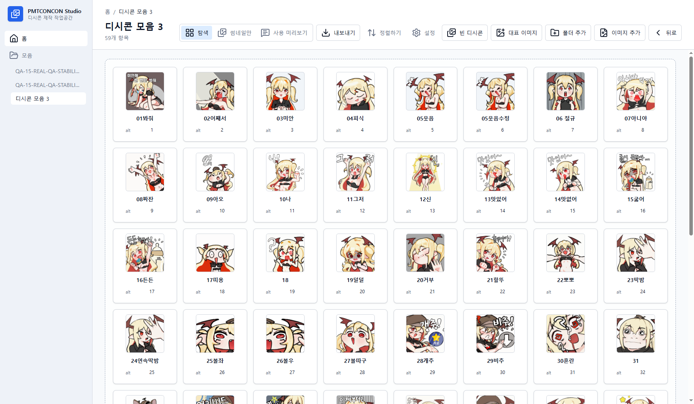
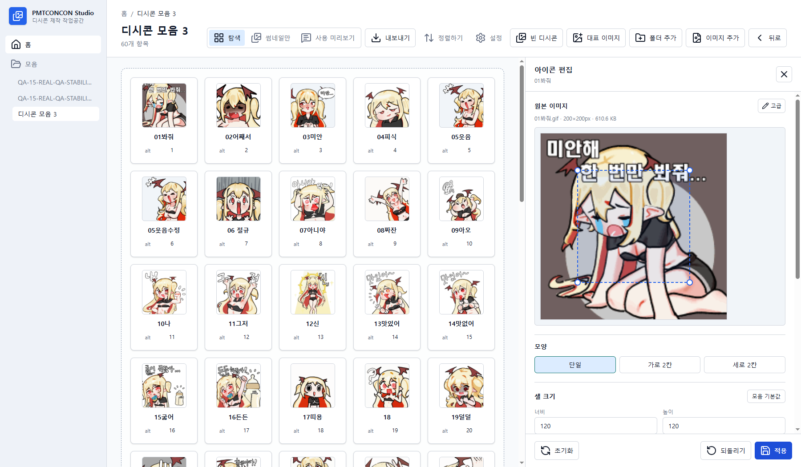
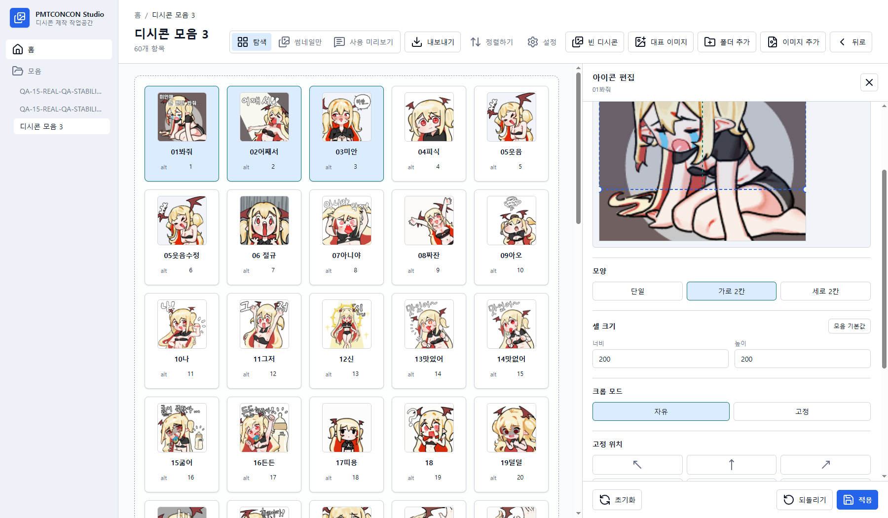
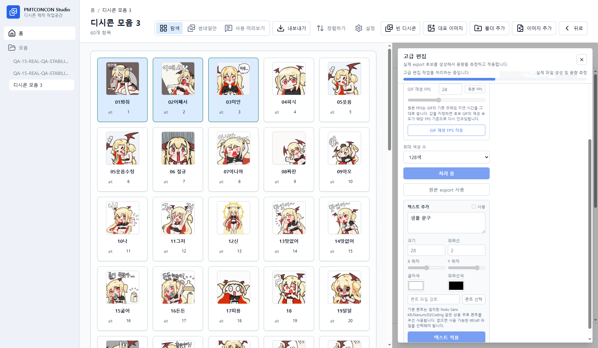
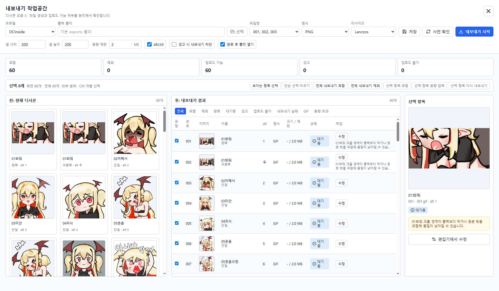
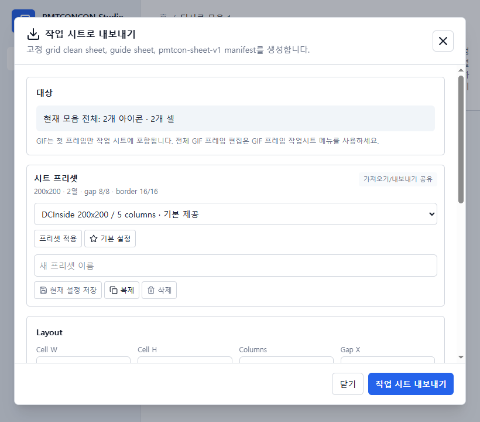
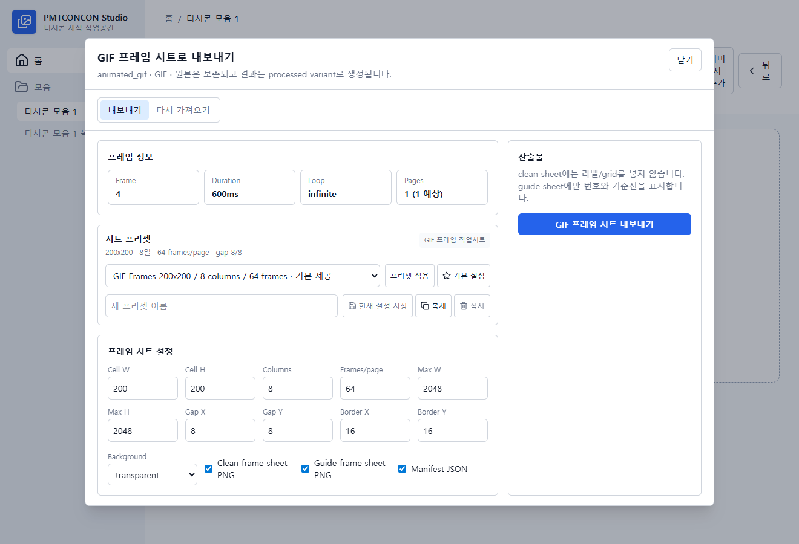

# PMTCONCON Studio

PMTCONCON Studio는 DCInside 스타일 디시콘과 커스텀 이모티콘 모음을 제작하기 위한 Windows 데스크톱 앱입니다. 이미지와 GIF를 가져오고, 모음 단위로 정리하고, 아이콘과 작업 시트를 편집한 뒤, 업로드 가능한 파일과 `alts.txt`를 내보내는 작업 흐름을 제공합니다.

최신 Windows 설치파일은 [GitHub Releases](https://github.com/kyunnkimeng-pixel/CONCONPMT/releases)에서 받을 수 있습니다.

상세 사용 설명서는 [PMTCONCON Studio 사용 설명서](https://kyunnkimeng-pixel.github.io/CONCONPMT/)에서 볼 수 있습니다.
릴리스 전 확인 범위는 [Release Readiness](docs/RELEASE_READINESS.md)에 정리되어 있습니다.
이번 버전의 주요 변경 사항은 [Release Notes 0.2.0](docs/RELEASE_NOTES_0.2.0.md)에서 볼 수 있습니다.

## 화면

### 모음 탐색과 alt 일괄 변경

아이콘을 카드형 탐색 화면에서 확인하고, alt 값 오류나 중복 상태를 바로 볼 수 있습니다. 여러 아이콘을 선택한 뒤 쉼표로 구분한 alt 값을 순서대로 일괄 적용할 수 있고, 파일/폴더 추가, 정렬, 대표 이미지 설정, 빈 디시콘 생성, 내보내기 작업으로 이어지는 도구 모음을 제공합니다.



### crop 박스 크기 조절

원본 이미지는 그대로 보존하고, 출력용 crop 박스만 별도로 저장합니다. 기본 DCInside 셀 크기는 200x200이며, crop 박스는 이미지 위에서 원하는 위치로 옮기거나 크기를 조정한 뒤 적용할 수 있습니다.



### 가로 2칸 자르기

한 아이콘을 2개의 200x200 조각으로 내보내야 하는 경우, 가로 2칸 모양을 선택해 400x200 crop 영역을 잡을 수 있습니다. 편집 화면은 분할선을 표시하고, 내보내기 단계에서는 왼쪽과 오른쪽 조각을 export 순서에 맞춰 생성합니다.



### 텍스트 추가와 고급 편집

텍스트 오버레이를 켜고 문구, 크기, 위치, 글자색, 외곽선, 폰트를 조정할 수 있습니다. 같은 고급 편집 화면에서 실제 export 후보를 생성해 용량을 측정하고, GIF 재생 FPS, 색상 수, JPG 품질 같은 압축 옵션도 적용할 수 있습니다.



### 내보내기 작업공간

내보낼 원본과 생성 결과를 나란히 보며, 파일명, 형식, 리사이즈 필터, MB 단위 용량 제한, `alts.txt` 생성 여부를 확인합니다. 항목별 업로드 가능 여부, 경고, 용량 초과, 수정 진입점을 분리해서 표시하고, 선택한 항목만 다시 내보내거나 용량 압축 후보를 일괄 적용할 수 있습니다.



### 스프라이트 시트와 작업 시트

큰 PNG/JPG 시트를 격자로 잘라 새 아이콘으로 가져오고, 선택한 아이콘이나 모음 전체를 clean sheet, guide sheet, manifest JSON으로 내보낼 수 있습니다. 수정된 작업 시트는 manifest로 다시 가져와 원본을 덮어쓰지 않고 새 아이콘이나 처리 variant로 저장합니다.



### GIF 프레임 작업 시트

GIF 아이콘은 우클릭 메뉴에서 모든 프레임을 PNG frame sheet로 내보내고, 수정된 frame sheet를 manifest로 다시 가져와 새 animated GIF variant를 만들 수 있습니다. 원본 GIF 파일은 보존됩니다.



## 주요 기능

- Windows 파일 탐색기와 비슷한 모음/아이콘 관리 화면
- JPG, PNG, 애니메이션 GIF 파일 및 폴더 가져오기
- 원본 파일 보존과 crop, 크기, 순서, 내보내기 설정의 별도 저장
- 200x200 기준 crop 박스 이동, 크기 조정, 자유/고정 모드 편집
- 단일 아이콘, 가로 2칸 아이콘, 세로 2칸 아이콘 편집과 조각별 내보내기
- GIF 미리보기, 프레임 기반 crop/export, 반복 설정 지원
- 아이콘 이름과 조각별 alt 값 인라인 편집
- 선택 아이콘 alt 값 일괄 변경과 쉼표 기반 순차 입력
- Ctrl/Shift 다중 선택과 드래그 앤 드롭 순서 변경
- 텍스트 오버레이 추가, 위치/크기/색상/외곽선/폰트 조정
- GIF FPS/색상 수 조정, JPG 품질 후보 생성
- GIF 재생 FPS 실시간 편집 미리보기와 variant 적용
- DCInside 규칙과 커스텀 프로필 기반 내보내기 검증
- Nearest, Bilinear, Bicubic, Gaussian, Lanczos 리사이즈 필터 선택
- 선택 항목만 다시 내보내기와 선택 항목 용량 압축
- 순서 기반 파일명 또는 alt 기반 파일명 내보내기
- 선택 가능한 `alts.txt` 생성
- 스프라이트 시트 가져오기와 manifest 기반 작업 시트 재가져오기
- 선택 아이콘만 작업 시트로 내보내기
- GIF 프레임 작업 시트 내보내기/교체하기
- 아이콘 메모와 hover 표시
- 가져오기/내보내기/GIF frame sheet에 공유되는 grid 프리셋
- 직접 Slice 지정과 자동 감지(실험) proposal 적용

## DCInside 내보내기

기본 DCInside 프로필은 200x200 출력 셀과 JPG, PNG, GIF 형식을 기준으로 동작합니다. 내보내기 전에 출력 개수, 파일 크기, 형식, alt 값 길이, alt 중복, 파일명 안전성을 검증합니다.

커스텀 모음에서는 셀 크기, 미리보기 표시 크기, 출력 형식, 파일 크기 제한, 파일명 방식을 별도로 설정할 수 있습니다.

## 개발 환경

필요한 도구:

- Node.js와 npm
- Rust toolchain
- Tauri 2 개발에 필요한 Windows 빌드 도구

의존성 설치:

```powershell
npm.cmd install
```

개발 실행:

```powershell
npm.cmd run tauri:dev
```

검사:

```powershell
npm.cmd run lint
npm.cmd run test
npm.cmd run build
```

데스크톱 앱 빌드:

```powershell
npm.cmd run tauri:build
```

## 기술 스택

- Tauri 2 + Rust
- React 19 + TypeScript + Vite
- Tailwind CSS
- TanStack Router
- dnd-kit
- react-konva
- SQLite

## 문서

- [제품 명세](docs/PRODUCT_SPEC.md)
- [기능 구현 현황](docs/FEATURE_INVENTORY.md)
- [구현 계획](docs/IMPLEMENTATION_PLAN.md)
- [아키텍처](docs/ARCHITECTURE.md)
- [기술 결정 기록](docs/DECISIONS.md)
- [Release Readiness](docs/RELEASE_READINESS.md)
- [Release Notes 0.2.0](docs/RELEASE_NOTES_0.2.0.md)
- [Installer Distribution QA](docs/INSTALLER_DISTRIBUTION_QA.md)
- [라이선스 정책](docs/LICENSE_POLICY.md)
- [서드파티 라이선스 고지 안내](docs/THIRD_PARTY_LICENSES_GUIDE.md)

## 라이선스

PMTCONCON Studio는 [MIT License](LICENSE)로 배포됩니다.

서드파티 의존성 고지는 [THIRD_PARTY_LICENSES.md](THIRD_PARTY_LICENSES.md)에 정리되어 있습니다.
